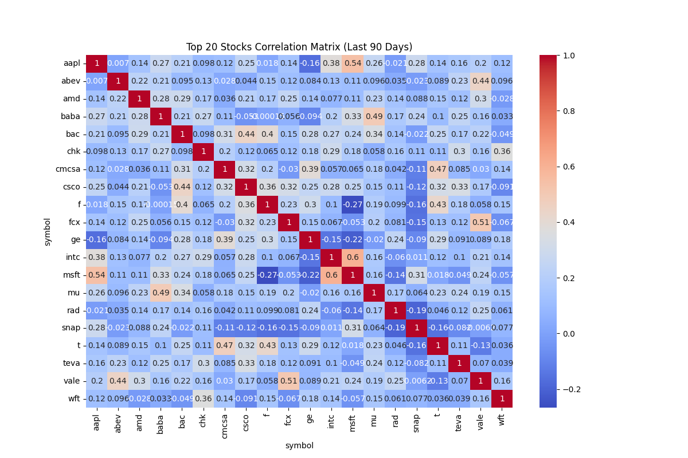

# Python/SQL Stock Market Analysis

DATASET: Historical stock market prices

DATASET Source: https://www.kaggle.com/datasets/borismarjanovic/price-volume-data-for-all-us-stocks-etfs

ROWS: 14,887,665

Columns:
date, open, high, low, close, volume, symbol

## Tools:
- Python
- PostgreSQL

### SQL
- Wrote SQL query to get 90 latest days from dataset. Also  didn't use openint  columns, because it had empty values.
- Exported dataset as **90_days.csv**

### Start
- Imported libraries.
- Got dataset from 90_days.csv

### Data Exploration
- Got basic information about the dataset 

## Data Preparation

### Null Test
- Found 64 **Null** values in symbol column
- Deleted missing data

### Duplicate test
- No duplicates found

### Logical Test
Ensured data had no logical errors.
 - HIgh >= Low
 - Volume >= 0
 - Close <= High / Close >= Low

### Date standardazing
- Standardized date column

### Data Export
- Exported cleaned Dataset **"clean_data.csv"**

## Analysis

### Quick Check
- Dataset was **correct**

### Tickers Amount
- Check amount of stock tickers (7161)

### Grouping Tickers
- Calculated sum volume fro each symbol. made sure symbol column was not an index.

### Top 20
- Got top 20 based on sum of volume and also reseted indexes

### Tickers List
- Created **top_symbols** list based on symbols from the previous table.

### Ticker Filtration
-Filtered Dataset using **top_symbols** list

## Main Analysis

### Daily Return
- Sorted on ticker and date
- Calculated daily return

### Volatility
- Created table with 10/30/90 days volatility on every stock.
- Created additional volatility rank

### Average volume
- Created table with 10/30/90 days averages on every stock.

### Correlation Matrix
- Created correlation matrix with 20 top stocks
- Also exproted **"correlation.png"** with heatmap based on matrix

## Conclusion

